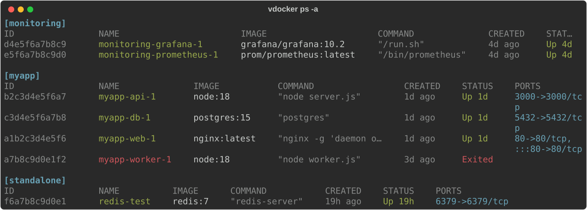
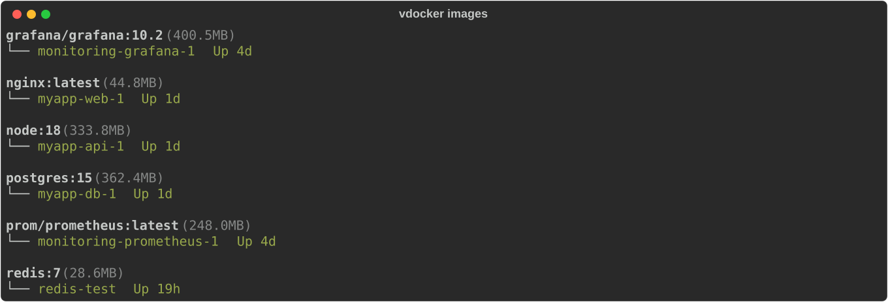
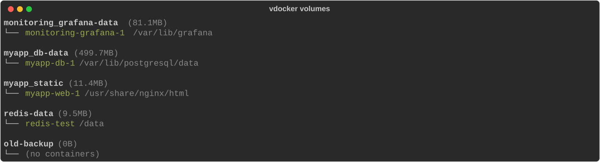
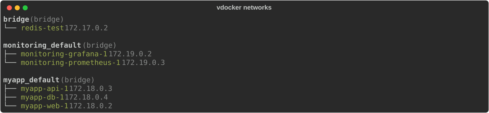
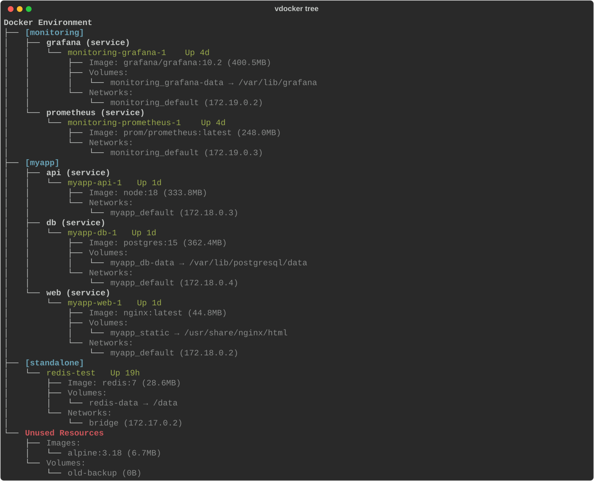
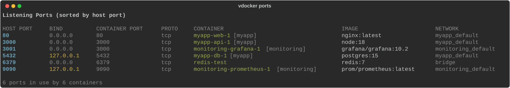
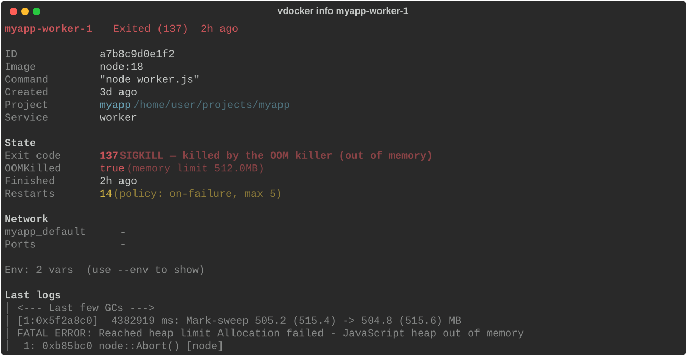

# vdocker

[](https://python.org)
[](https://docker.com)
[](https://github.com/justperson94/vdocker/blob/main/LICENSE)
[](https://github.com/justperson94/vdocker/releases)
[](https://github.com/justperson94/vdocker/releases)
[](https://github.com/justperson94/vdocker/actions/workflows/ci.yml)

A CLI tool that visualizes Docker objects (containers, images, volumes, networks) and their relationships in grouped/tree format.

Solves the problem of containers from different services being mixed together in `docker ps` output.

## Installation

### Quick install (macOS / Linux)

One command — detects your OS, downloads the latest binary, and puts `vdocker` on your PATH:

```bash
curl -fsSL https://raw.githubusercontent.com/justperson94/vdocker/main/install.sh | sh
```

### Homebrew (macOS / Linux)

```bash
brew install justperson94/tap/vdocker
```

### Binary (no Python required)

Download from [Releases](https://github.com/justperson94/vdocker/releases)
(Linux x86_64 and Apple Silicon; Intel Macs: use pip). The
archive holds a `vdocker` directory — keep it intact and symlink the executable:

```bash
# Linux
curl -L -o vdocker.tar.gz https://github.com/justperson94/vdocker/releases/latest/download/vdocker-linux-amd64.tar.gz
tar xzf vdocker.tar.gz
sudo mv vdocker /usr/local/lib/vdocker
sudo ln -sf /usr/local/lib/vdocker/vdocker /usr/local/bin/vdocker
```

### pip

```bash
pip install git+https://github.com/justperson94/vdocker.git
```

### From source

```bash
git clone https://github.com/justperson94/vdocker.git
cd vdocker
pip install -e .
```

## Usage

### `vdocker ps` — Group containers by compose project



### `vdocker images` — Show images with dependent containers



Use `--unused` flag to include images with no containers.

### `vdocker volumes` — Show volumes with mounted containers



### `vdocker networks` — Show networks with connected containers



### `vdocker tree` — Full relationship tree



### `vdocker ports` — Who is using which port

All host-exposed ports in one sorted table. The BIND column makes the
security-relevant difference between `0.0.0.0` (open to the world) and
`127.0.0.1` (localhost only) visible at a glance:



### `vdocker info` — One-screen container summary

Everything you would dig out of `docker inspect` (state, IP, ports, mounts,
health, restart policy) in one readable screen — no `--format` or `jq` needed.
For dead containers it explains **why** it died: decoded exit code, OOMKilled,
daemon error, and the last log lines:



```bash
vdocker info myapp-db-1          # running: uptime, health, network, mounts
vdocker info myapp-worker-1      # dead: decoded exit code + last 10 log lines
vdocker info myapp-db-1 --env    # include env vars (sensitive values masked)
```

### `vdocker exec` — Open a shell inside a container

Shortcut for `docker exec -it <container> <shell>`:

```bash
vdocker exec myapp-web-1        # bash, falls back to sh
vdocker exec myapp-web-1 sh     # use a specific shell
```

Press `<Tab>` after `vdocker exec` or `vdocker info` to autocomplete container
names. Completion is set up automatically by the install script; otherwise
enable it with:

```bash
# bash
echo 'eval "$(_VDOCKER_COMPLETE=bash_source vdocker)"' >> ~/.bashrc
# zsh
echo 'eval "$(_VDOCKER_COMPLETE=zsh_source vdocker)"' >> ~/.zshrc
```

## Options

| Option | Description |
|--------|-------------|
| `-a, --all` | Include stopped containers (`ps`, `tree`) |
| `--json` | Output as JSON (all commands except `exec`) |
| `--unused` | Show images without containers (`images` only) |
| `--env` | Show env vars, sensitive values masked (`info` only) |

## Notes

- The working directory path shown next to project names (e.g. `[myapp]  /home/user/projects/myapp`) is only available for containers started via `docker compose up`. Standalone containers (`docker run`) do not have this information.

## Uninstall

```bash
# installed via install.sh (adjust prefix if you used /usr/local)
rm -rf ~/.local/lib/vdocker ~/.local/bin/vdocker
# optional: remove the "vdocker shell completion" line from ~/.bashrc or ~/.zshrc

# installed via Homebrew
brew uninstall vdocker
```

## Requirements

- Docker running
- Python 3.10+ (for pip install)

## License

MIT

## Author

Hyunwoo Song <justperson94@gmail.com>
